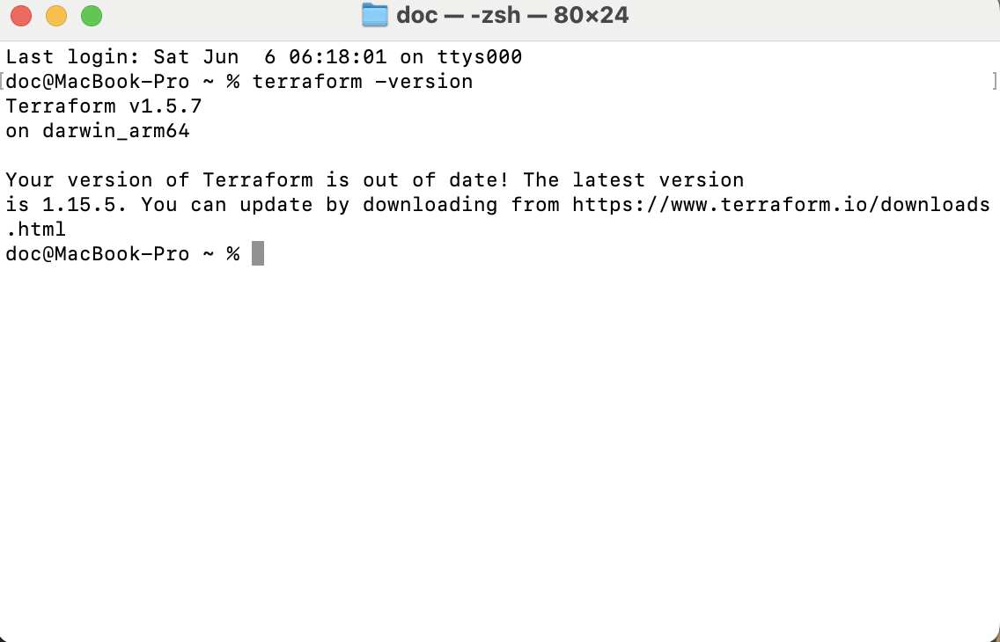

# AWS Terraform IAM Automation Lab

## Project Overview

This project demonstrates how to use Terraform to automate AWS infrastructure and Identity and Access Management (IAM) resources using Infrastructure as Code (IaC).

The lab covers the complete Terraform lifecycle:

* Installing Terraform
* Configuring AWS CLI authentication
* Initializing a Terraform project
* Creating AWS resources
* Updating existing resources
* Reviewing execution plans
* Destroying resources to prevent unnecessary cloud costs

## Technologies Used

* Terraform
* AWS IAM
* Amazon S3
* AWS CLI
* Infrastructure as Code (IaC)

## Architecture

Terraform Configuration
↓
AWS Provider
↓
AWS IAM User
AWS S3 Bucket
↓
Terraform State
↓
Infrastructure Lifecycle Management

---

## Step 1: Install Terraform

Terraform was installed and verified on macOS.

---

## Step 2: Configure AWS CLI Authentication

AWS CLI was configured using IAM access keys and tested successfully using the Security Token Service (STS).

---

## Step 3: Initialize Terraform

The Terraform working directory was initialized and prepared for Infrastructure as Code deployments.

---

## Step 4: Create Infrastructure Plan

Terraform analyzed the configuration and generated an execution plan before making any changes.

---

## Step 5: Create IAM Resources

Terraform successfully provisioned an IAM user in AWS.

---

## Step 6: Update Infrastructure Through Code

The IAM user definition was modified in Terraform code and Terraform detected the change before deployment.

---

## Step 7: Verify Infrastructure Updates

The updated IAM user was successfully deployed and verified in the AWS Management Console.

---

## Step 8: Review Resource Destruction Plan

Terraform generated a destruction plan to safely remove managed resources.

---

## Step 9: Destroy Infrastructure

Terraform removed all managed resources and cleaned up the AWS environment.

---

## Skills Demonstrated

* Terraform Fundamentals
* AWS IAM Administration
* Infrastructure as Code (IaC)
* AWS CLI Configuration
* Terraform State Management
* Resource Lifecycle Management
* Change Management
* Cloud Security Best Practices
* Infrastructure Planning and Validation
* AWS Resource Provisioning

## Key Takeaways

This project demonstrates the complete Infrastructure as Code workflow using Terraform and AWS. Resources were provisioned, modified, validated, and destroyed entirely through code without manual changes in the AWS console.

The lab highlights core skills used by Cloud Engineers, IAM Administrators, DevOps Engineers, and Cloud Security professionals when managing infrastructure in production environments.
