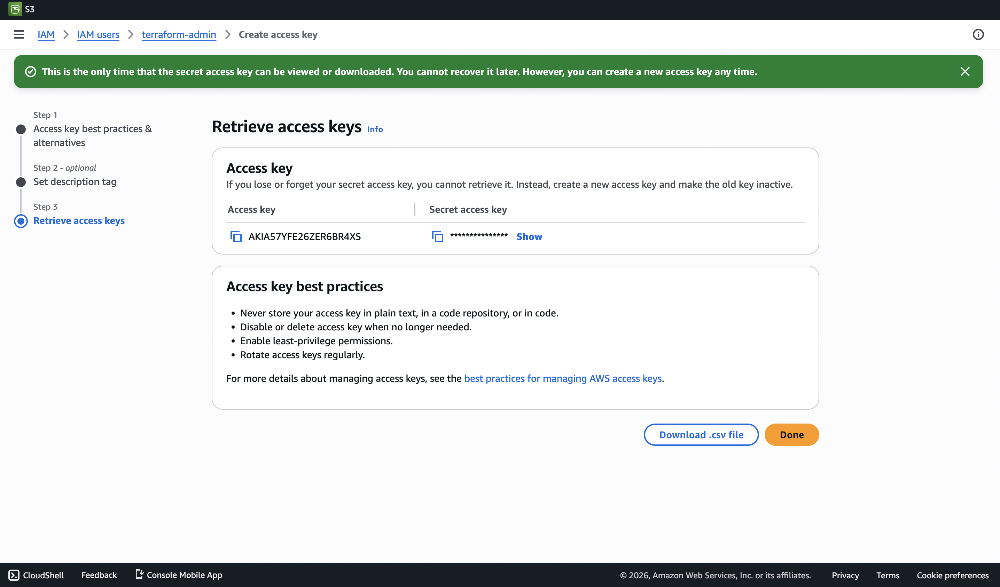
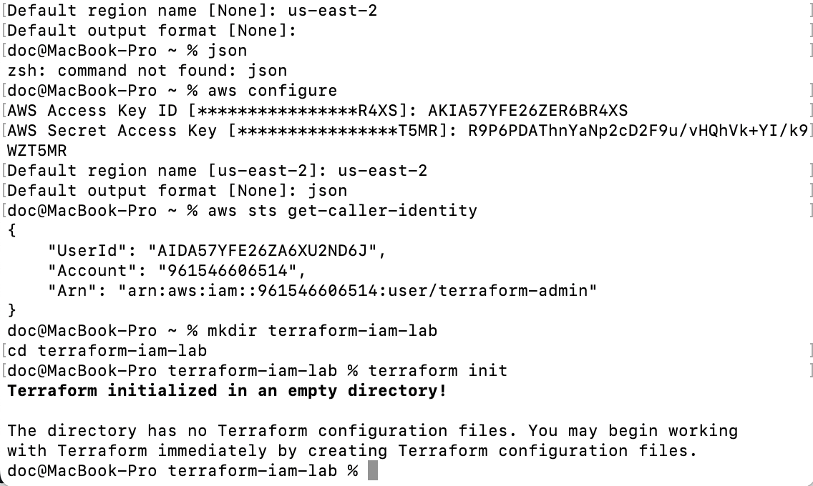
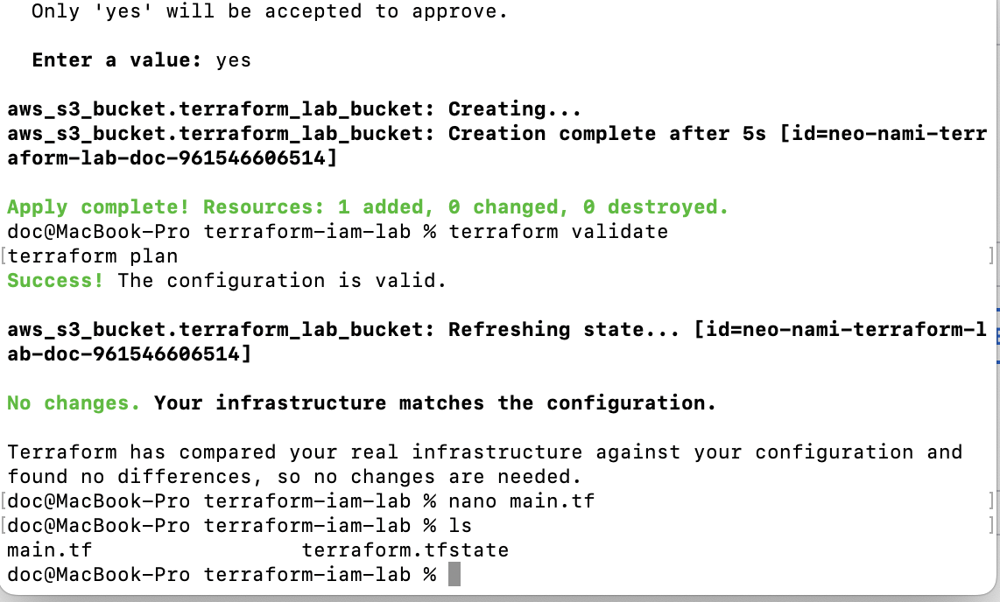
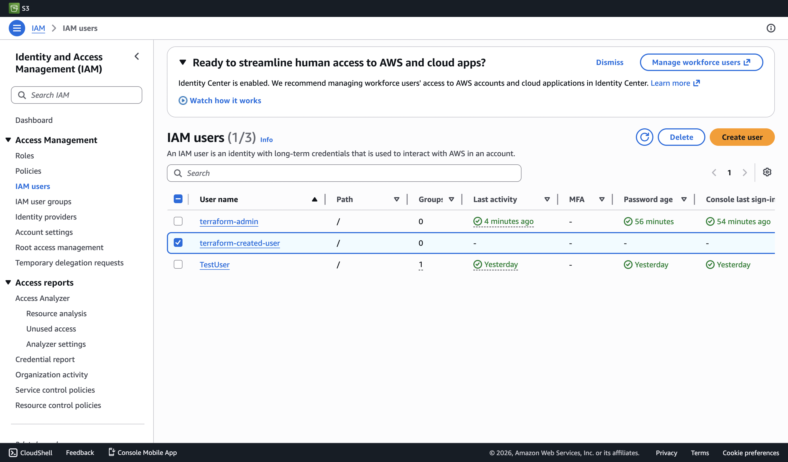
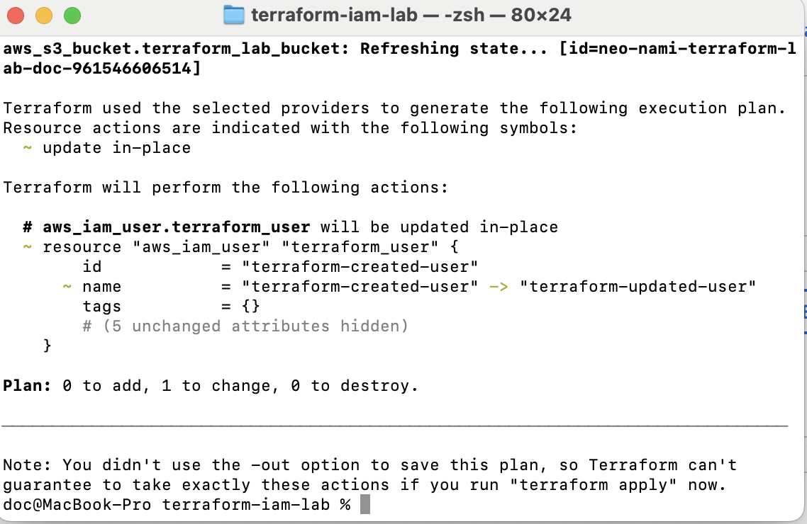
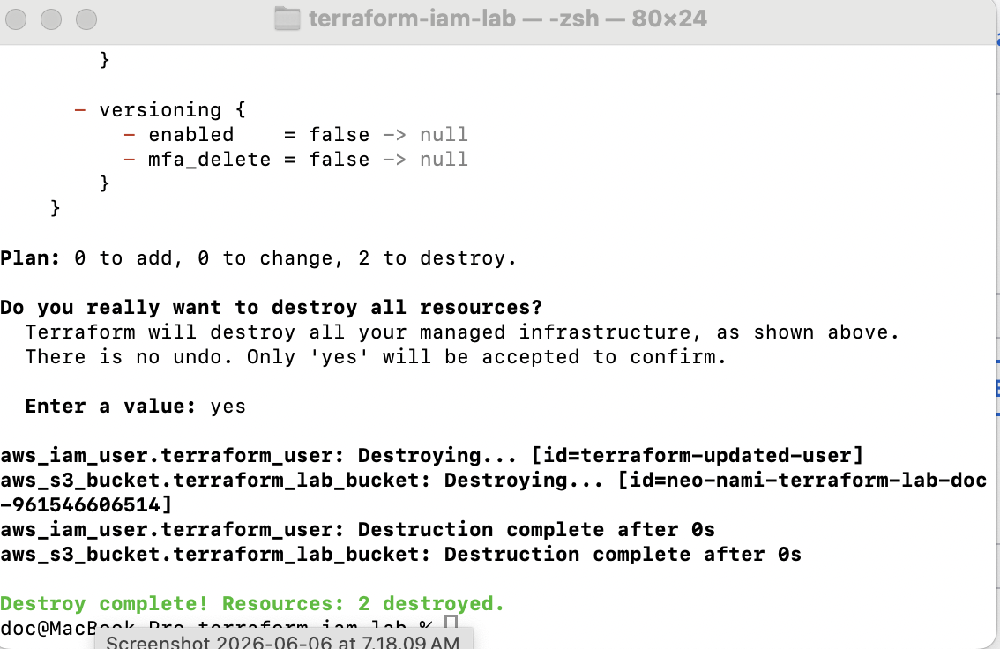
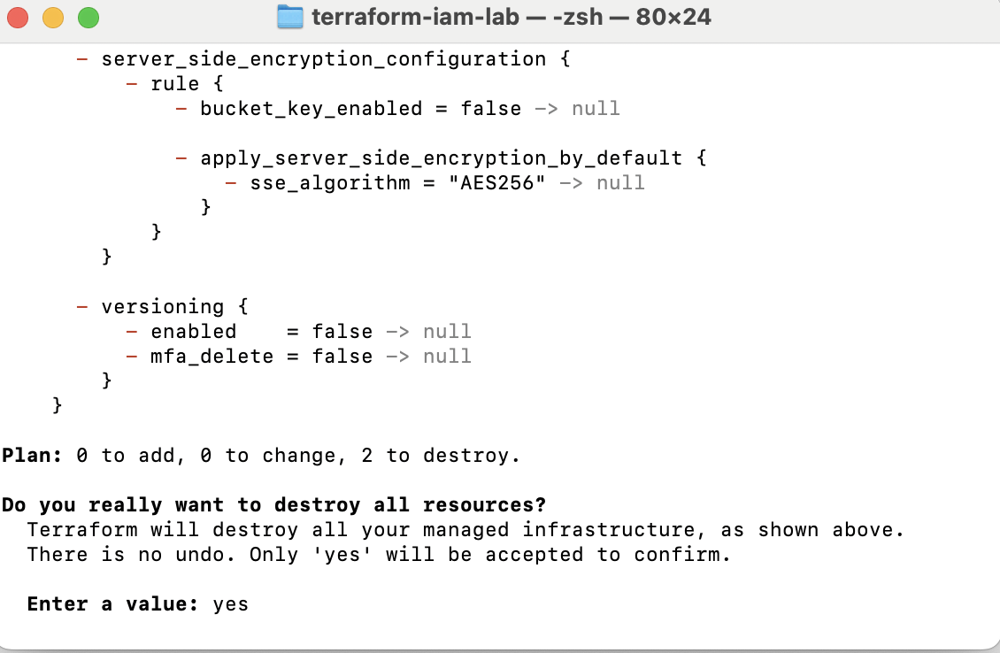

# Terraform IAM Automation Lab

## Project Overview

## Technologies Used

## Architecture

## Step 1 - Configure AWS CLI

## Step 2 - Initialize Terraform

## Step 3 - Create IAM User

## Step 4 - Update IAM User

## Step 5 - Destroy Resources

## Skills Demonstrated

- Terraform
- Infrastructure as Code (IaC)
- AWS IAM
- AWS CLI
- Resource Lifecycle Management
- Cloud Automation
